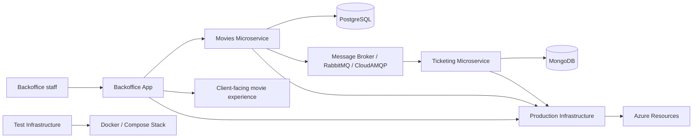

# HowestPrime Movies Platform

A full movie platform built as a small, event-driven software ecosystem. This workspace brings together a staff backoffice, a movie microservice, a ticketing microservice, and the deployment infrastructure needed to run and validate the system in both local and production-like environments.

The project is intentionally split into separate repositories and responsibilities instead of one monolithic app. That makes the platform easier to evolve, test, and deploy while keeping each domain focused and independent.

## Platform at a glance

This workspace contains five related project areas:

- [st-client-backoffice-Maurice-De-Kegel](st-client-backoffice-Maurice-De-Kegel) — the cinema admin application used by staff
- [st-microservice-movies-Maurice-De-Kegel](st-microservice-movies-Maurice-De-Kegel) — the movie catalog and event-driven backend service
- [st-microservice-ticketing-Maurice-De-Kegel](st-microservice-ticketing-Maurice-De-Kegel) — the ticketing, ordering, and booking domain
- [st-infrastructure-test-Maurice-De-Kegel](st-infrastructure-test-Maurice-De-Kegel) — local Docker-based integration environment for validation
- [st-infrastructure-prod-Maurice-De-Kegel](st-infrastructure-prod-Maurice-De-Kegel) — production-grade Terraform setup for Azure and CI/CD

## High-level architecture

## Why this project is structured this way

This platform is designed around a typical microservice approach:

- The movie domain owns movie-related data and business rules.
- The ticketing domain owns bookings, suggestions, orders, and payment-related workflows.
- The backoffice is a privileged admin interface used to manage catalog content and screening plans.
- Infrastructure is separated so the system can be deployed, scaled, and monitored consistently across environments.
- Messaging connects the services without tight coupling, allowing them to react to each other’s events.

## Project roles

### 1. Backoffice application

Repository: [st-client-backoffice-Maurice-De-Kegel](st-client-backoffice-Maurice-De-Kegel)

This is the staff-facing admin app built with .NET and Blazor Server. It gives cinema staff a way to manage the content and planning side of the business.

Main responsibilities:

- Register and update movies in the catalog
- Browse movie metadata and details
- Create or adjust screening schedules for rooms
- View planning data in a month-based calendar view
- Validate and interact with backend APIs through typed client models

This application is the operational control center for the movie side of the platform. It is not the end-user app; it is the internal tool used by operators and administrators.

### 2. Movie microservice

Repository: [st-microservice-movies-Maurice-De-Kegel](st-microservice-movies-Maurice-De-Kegel)

This is the main domain service responsible for movie data. It exposes a REST API for creating, updating, retrieving, and deleting movie information and provides the foundation for catalog management across the broader platform.

Main responsibilities:

- Manage the movie catalog
- Support filtering, pagination, and search-like operations
- Publish domain events when movies change
- Expose Swagger/OpenAPI documentation for interaction and testing
- Run in a container-friendly environment with externalized configuration

The movie service is the source of truth for movie metadata in the platform. It acts as the data and event producer for the rest of the system.

### 3. Ticketing microservice

Repository: [st-microservice-ticketing-Maurice-De-Kegel](st-microservice-ticketing-Maurice-De-Kegel)

This service handles the ticketing domain: suggestions, orders, customer activity, payment transitions, and any process tied to the commercial flow around a movie screening.

Main responsibilities:

- Suggestion management
- Movie synchronization from upstream events
- Order creation and lifecycle handling
- Customer data collection for bookings
- Payment success/failure workflow processing
- Integration with MongoDB and a message broker

This service listens to events from other parts of the platform and reacts to them asynchronously. In other words, it turns core platform events into booking and business workflows.

### 4. Local integration test infrastructure

Repository: [st-infrastructure-test-Maurice-De-Kegel](st-infrastructure-test-Maurice-De-Kegel)

This is the local environment used to run the platform as a connected system during development and testing. It uses Docker Compose to bring up the supporting services in a realistic stack.

Main responsibilities:

- Start PostgreSQL for the movies service
- Start MongoDB for the ticketing service
- Start LavinMQ for asynchronous messaging
- Run the relevant APIs together locally
- Expose ports for quick API and UI testing

This repository is the “system test” layer for the project. It helps validate that all services actually work together, not just in isolation.

### 5. Production infrastructure

Repository: [st-infrastructure-prod-Maurice-De-Kegel](st-infrastructure-prod-Maurice-De-Kegel)

This is the Azure and Terraform layer that provisions the shared production platform and CI/CD foundation.

Main responsibilities:

- Create the Azure resource group and shared services
- Provision databases and messaging infrastructure
- Set up Azure Container Registry and hosting environments
- Configure managed identities and Key Vault access
- Connect GitHub Actions and deployment automation
- Support the client and backoffice apps as well as the microservices

This repo is the operational backbone of the project. It ensures the application components can be deployed in a consistent, repeatable cloud environment.

## How everything ties together

The platform works as a connected ecosystem:

1. Staff use the backoffice to create or update movie data.
2. The backoffice calls the Movies API, which stores the movie catalog and validates data.
3. The Movies service publishes events when movies are created, updated, or changed.
4. The Ticketing service listens for those events and keeps its own domain data in sync.
5. The ticketing domain then manages suggestions, orders, and payment-driven transitions.
6. The local test infrastructure validates that the services run together with Docker and messaging.
7. The production infrastructure provisions the cloud resources and deployment pipeline for all services and apps.

This creates a clean separation of concerns:

- Catalog and movie data live in the movie service.
- Booking logic and ticketing workflows live in the ticketing service.
- Operators use the backoffice for management.
- Cloud infrastructure supports deployment and runtime hosting.
- Messaging keeps the services loosely connected and event-driven.

## Typical product flow

A typical end-to-end flow in the platform looks like this:

- A movie is registered in the backoffice.
- The movie service persists the movie record.
- A message is published to the shared broker.
- The ticketing service consumes the event and updates its ticketing context.
- The business workflow continues with suggestions, orders, and payment states.
- The platform can be validated locally with Docker and then deployed through Azure infrastructure.

## Summary

This is not just a single app; it is a complete digital cinema ecosystem. Each repository has a clear role, and together they form a platform that covers:

- content management
- movie catalog operations
- ticketing and booking workflows
- event-driven communication
- local validation
- production deployment and automation

The result is a modular, realistic system that reflects the way modern cloud-native applications are built and operated.

## Repository purpose

The workspace is a multi-repository project designed to demonstrate how modern software systems can be split into domain-centered services and infrastructure layers, while still integrating into a single, coherent product experience.
