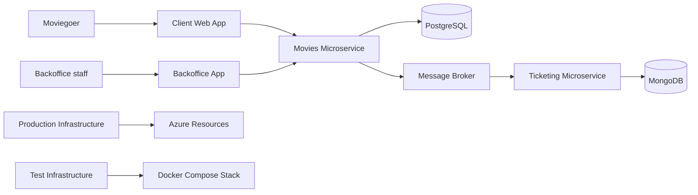

<div align="center">

# 🎬 HowestPrime Movies Platform

**An event-driven cinema platform built as a small ecosystem of microservices, apps and infrastructure.**


</div>

> 🎓 Created for the **Build and Deploy** course in the **Applied Computer Science – Software Engineering** program at **Howest**.

## 📑 Table of Contents

- [About](#-about)
- [Repositories](#-repositories)
- [Architecture](#-architecture)
- [Components](#-components)
- [How It Works](#-how-it-works)
- [Design Principles](#-design-principles)
- [Getting Started](#-getting-started)
- [Author](#-author)

## 📖 About

HowestPrime is a complete digital cinema ecosystem: a customer web app, a staff backoffice, a movie service, a ticketing service, and the infrastructure to validate it locally and deploy it to Azure. Each part lives in its own repository with a clear responsibility.

## 📦 Repositories

| Repository | Description |
|---|---|
| 🌐 **Client web app** *(teacher-provided)* | Public site where customers browse movies and consume the ticketing APIs |
| [🛠️ st-client-backoffice](st-client-backoffice-Maurice-De-Kegel) | Staff admin app (.NET, Blazor Server) |
| [🎞️ st-microservice-movies](st-microservice-movies-Maurice-De-Kegel) | Movie catalog service and event producer |
| [🎟️ st-microservice-ticketing](st-microservice-ticketing-Maurice-De-Kegel) | Suggestions, orders, customers and payments |
| [🧪 st-infrastructure-test](st-infrastructure-test-Maurice-De-Kegel) | Docker Compose stack for local integration testing |
| [☁️ st-infrastructure-prod](st-infrastructure-prod-Maurice-De-Kegel) | Terraform for Azure plus CI/CD |

## 🏗️ Architecture



## 🧩 Components

### 🌐 Client web app
Public front end for customers. Shows movie listings and details and calls the backend APIs for movie and ticketing data.

### 🛠️ Backoffice
Internal admin tool for cinema staff.
- Register and update movies
- Browse movie metadata
- Create screening schedules per room
- View planning in a monthly calendar

### 🎞️ Movies service
Source of truth for movie metadata.
- REST API with CRUD, filtering, pagination and search-like queries
- Swagger/OpenAPI documentation
- PostgreSQL storage
- Publishes domain events on every change
- Container-friendly with externalized configuration

### 🎟️ Ticketing service
Owns the commercial flow around screenings.
- Suggestions, orders and customer data
- Payment success/failure transitions
- MongoDB storage
- Syncs movie data by consuming broker events

### 🧪 Test infrastructure
Docker Compose environment running PostgreSQL, MongoDB, LavinMQ and the APIs together, with exposed ports for quick testing. It validates that the services work together, not just in isolation.

### ☁️ Production infrastructure
Terraform setup for Azure: resource group, databases, messaging, Container Registry and hosting, managed identities with Key Vault access, and GitHub Actions to deploy all apps and services.

## 🔄 How It Works

1. Customers browse movies in the client web app.
2. Staff create or update movies in the backoffice.
3. The Movies API validates and stores the data, then publishes an event to the broker.
4. The Ticketing service consumes the event and updates its own data.
5. Ticketing continues with suggestions, orders and payment states.
6. The stack is validated locally with Docker, then deployed to Azure.

## 🎯 Design Principles

- **Separation of concerns:** movies, ticketing, UI and infrastructure each have their own repository.
- **Loose coupling:** services communicate asynchronously through messaging.
- **Repeatable environments:** the same system runs locally via Docker and in the cloud via Terraform and CI/CD.

## 🚀 Getting Started

To run the full system locally, use the [test infrastructure repository](st-infrastructure-test-Maurice-De-Kegel):

```bash
git clone <repo-url>
cd st-infrastructure-test-Maurice-De-Kegel
docker compose up
```

See each repository's README for service-specific setup.

## 👤 Author

**Maurice De Kegel**, Howest – Applied Computer Science, Software Engineering
