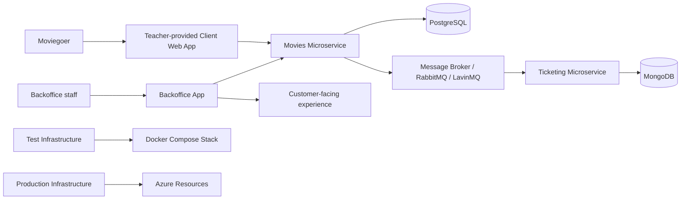

<div align="center">

# 🎬 HowestPrime Movies Platform

**A modular movie platform made up of a customer web app, a staff backoffice, domain microservices, and infrastructure-as-code.**

<p>
  
  
  
  
  
  
  
  
</p>

</div>

> Built as a multi-repository system for the HowestPrime movie platform.

## 📑 Table of Contents

- [📖 About](#about)
- [🏗️ Architecture](#architecture)
- [✨ Features](#features)
- [📦 Repositories](#repositories)
- [🛠️ Tech Stack](#tech-stack)
- [🚀 Getting Started](#getting-started)
- [📄 License](#license)
- [👤 Author](#author)

## 📖 About

- This workspace combines the public client experience, the staff backoffice, two domain microservices, and the infrastructure needed to run them.
- The solution is split across separate repositories so each domain can evolve, test, and deploy independently.
- The platform is event-driven, with messaging used to keep the microservices loosely coupled.
- Production deployment is managed with Terraform and Azure, while local validation relies on Docker-based infrastructure.

## 🏗️ Architecture



## ✨ Features

**🎟️ Customer and staff experience**

- Public movie browsing through the teacher-provided client web app.
- Staff-facing backoffice for catalog maintenance and screening planning.
- Separate responsibilities for customer, admin, and service workflows.

**🎬 Domain services**

- Movies service for the movie catalog and event publishing.
- Ticketing service for suggestions, orders, and booking workflows.
- Shared messaging to keep the platform responsive and decoupled.

**🏗️ Infrastructure**

- Docker-based test environment for local system validation.
- Terraform-based production infrastructure for Azure deployment.
- GitHub automation and shared cloud resources for repeatable releases.

## 📦 Repositories

| Repository | Purpose |
| --- | --- |
| [st-client-backoffice-Maurice-De-Kegel](st-client-backoffice-Maurice-De-Kegel) | Staff-facing backoffice for catalog management and planning |
| [st-microservice-movies-Maurice-De-Kegel](st-microservice-movies-Maurice-De-Kegel) | Movie catalog API and event producer |
| [st-microservice-ticketing-Maurice-De-Kegel](st-microservice-ticketing-Maurice-De-Kegel) | Ticketing, ordering, and booking workflows |
| [st-infrastructure-test-Maurice-De-Kegel](st-infrastructure-test-Maurice-De-Kegel) | Local Docker-based integration stack |
| [st-infrastructure-prod-Maurice-De-Kegel](st-infrastructure-prod-Maurice-De-Kegel) | Production Azure and Terraform setup |

## 🛠️ Tech Stack

| Area | Technologies |
| --- | --- |
| Frontend | Blazor Server, .NET 10 |
| Movies service | ASP.NET Core, Entity Framework Core, Swagger/OpenAPI |
| Ticketing service | Deno, TypeScript, Oak, AsyncAPI/OpenAPI |
| Infrastructure | Terraform, Azure, GitHub Actions |
| Data stores | PostgreSQL, MongoDB |
| Messaging | RabbitMQ, LavinMQ |
| Local development | Docker, Docker Compose |

## 🚀 Getting Started

### Clone the workspace

```bash
git clone <repository-url>
cd howestprime-movies
```

### Work with the repository you need

- Open [st-client-backoffice-Maurice-De-Kegel](st-client-backoffice-Maurice-De-Kegel) for the Blazor backoffice.
- Open [st-microservice-movies-Maurice-De-Kegel](st-microservice-movies-Maurice-De-Kegel) for the movies API.
- Open [st-microservice-ticketing-Maurice-De-Kegel](st-microservice-ticketing-Maurice-De-Kegel) for the ticketing service.
- Open [st-infrastructure-test-Maurice-De-Kegel](st-infrastructure-test-Maurice-De-Kegel) for the local Docker stack.
- Open [st-infrastructure-prod-Maurice-De-Kegel](st-infrastructure-prod-Maurice-De-Kegel) for the Azure Terraform setup.

### Typical local workflow

1. Start the local infrastructure.
2. Run the movies service.
3. Run the ticketing service.
4. Start the backoffice.
5. Validate the end-to-end flow through the public client and the admin tools.

## 📄 License

This workspace is part of an educational project for the HowestPrime movie platform. No separate license file is provided at the root of the workspace.

## 👤 Author

| Name | GitHub | LinkedIn |
| --- | --- | --- |
| Maurice De Kegel | [MriceDK](https://github.com/MriceDK) | [LinkedIn](https://www.linkedin.com/in/dekegelmaurice/) |
